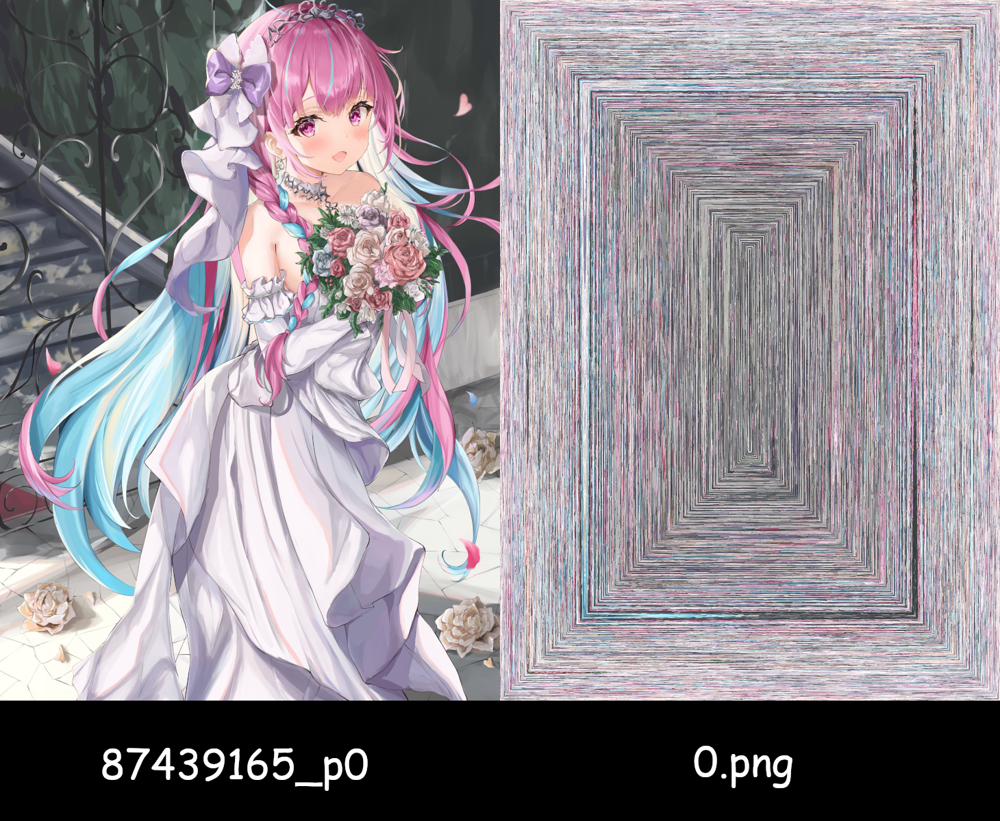

# Snail Image Obfuscate

[简体中文](readme_cn.md)

Snail Image Obfuscate is a simple tool of image confusing,
to bypass image censorship for example in IM.

The result may seem strange, but it is practical.

Nowadays, it only supports output in PNG format.

## Example

After calling `./snail_image_confuse 87439165_p0.jpg 1.png`:

## Credit

This project is highly inspired by a codewars kata, [Snail](https://www.codewars.com/kata/521c2db8ddc89b9b7a0000c1).

87439165_p0.jpg is a work of [御巫 ゆり](https://www.pixiv.net/users/47219840), which is not licensed under MIT.
