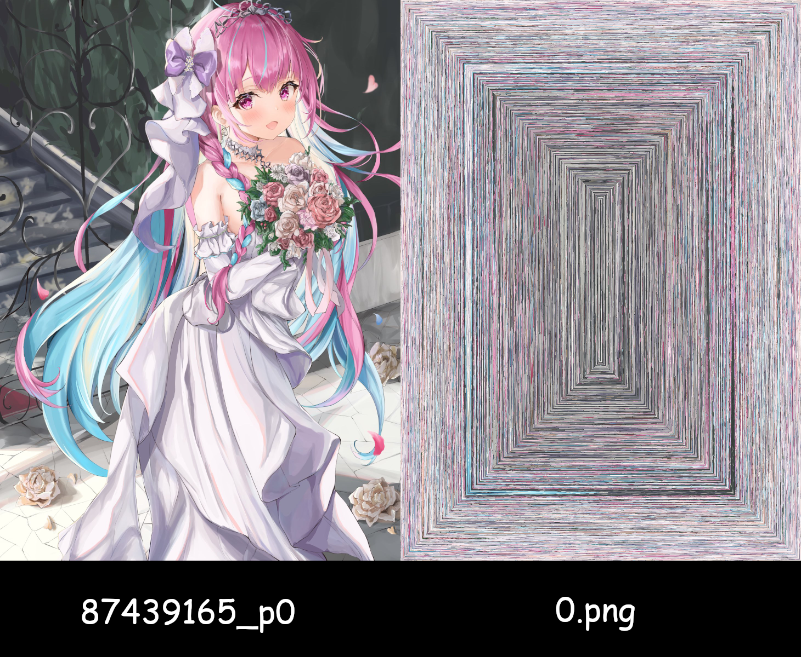

# Snail Image Confuse

Snail Image Confuse 是个简易的图片混淆工具，
用于绕过图片审查，比如在即时聊天软件中。

生成的结果可能有点奇怪，不过实用型可能不错？

目前只支持生成PNG文件，因为我懒得写一些逻辑……

## 示例

## Credit

这个项目很大程度上受到一个Codewars Kata的启发，也就是[Snail](https://www.codewars.com/kata/521c2db8ddc89b9b7a0000c1).

87439165_p0,jpg 是[御巫 ゆり](https://www.pixiv.net/users/47219840)的作品，不在MIT许可证下发布。
